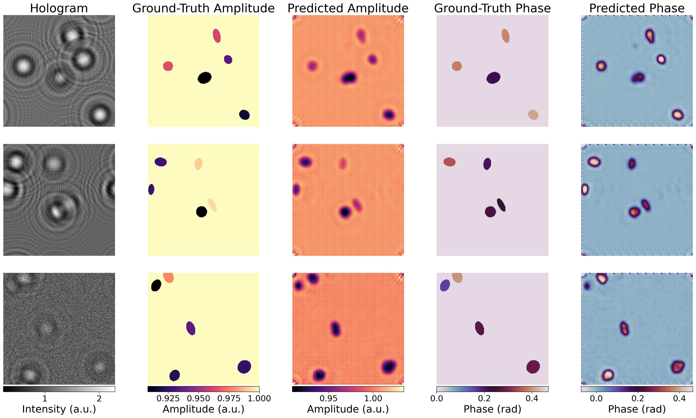
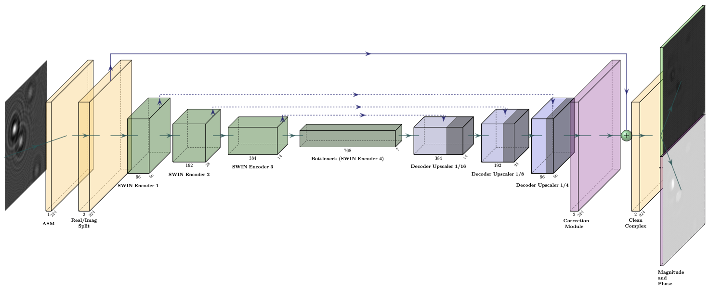

<div align="center">

# HoloPASWIN

**Robust Inline Holographic Reconstruction via Physics-Aware Swin Transformers**

[](https://arxiv.org/abs/2603.04926)
[](https://huggingface.co/gokhankocmarli/holopaswin-v3)
[](https://huggingface.co/datasets/gokhankocmarli/inline-digital-holography-v3)
[](https://huggingface.co/spaces/gokhankocmarli/holopaswin-v3)
[](https://electricalgorithm.github.io/holopaswin/)



*HoloPASWIN recovers clean phase and amplitude mappings from a single intensity hologram, directly eliminating twin-image artifacts.*
</div>

## Overview

> **🤗 Try the interactive Web Demo on Hugging Face Spaces:** [gokhankocmarli/holopaswin-v3-space](https://huggingface.co/spaces/gokhankocmarli/holopaswin-v3)

HoloPASWIN is a deep learning framework designed to eliminate the twin-image artifact in inline digital holography. While inline holography is an effective lensless imaging technique, the loss of phase information during capturing causes an out-of-focus duplicate (twin-image) to permanently degrade the reconstructed object.

This repository implements a Physics-Aware Swin Transformer U-Net that inherently corrects and removes these artifacts. By integrating a forward physics model (the Angular Spectrum Method) with the Swin Transformer's global attention, HoloPASWIN achieves robust phase recovery and high structural fidelity across varying noise levels and distances.


## Network Architecture



HoloPASWIN utilizes a U-shaped architecture based on Swin Transformer blocks. The model first processes an input intensity hologram using the backward Angular Spectrum Method (ASM) to obtain an initial, artifact-heavy complex field. A 4-stage Swin Encoder-Decoder network then extracts multi-scale features to predict a residual correction. By adding this correction to the initial field and training with both frequency-domain constraints and a physics-based forward propagation loss, the network robustly recovers the clean phase and amplitude.


## Installation

This project uses [uv](https://github.com/astral-sh/uv) for fast and reliable dependency management.

1.  **Install uv** (if not already installed):
    ```bash
    curl -LsSf https://astral.sh/uv/install.sh | sh
    ```

2.  **Sync Dependencies**:
    Navigate to the `holopaswin` directory and run:
    ```bash
    uv sync
    ```
    This creates a virtual environment and installs all locked dependencies from `uv.lock`.

## Usage

### Training

To train the model from scratch on the dataset, run:

```bash
uv run src/train.py
```

### Inference & Testing

To evaluate a trained model and generate visualization results on test samples, run:

```bash
uv run src/inference.py
```

To calculate full quantitative metrics (SSIM, PSNR, MSE) over the test dataset, run:

```bash
uv run src/test.py
```

### Development

This repository includes pre-commit hooks that automatically run code quality checks (`ruff` and `mypy`) before each commit. To install them:

```bash
./scripts/install-hooks.sh
```

If any check fails, the commit will be blocked.

## Citation

If you find this code, dataset, or model useful for your research, please cite our paper:

```bibtex
@misc{kocmarli2026holopaswinrobustinlineholographic,
      title={HoloPASWIN: Robust Inline Holographic Reconstruction via Physics-Aware Swin Transformers}, 
      author={Gökhan Koçmarlı and G. Bora Esmer},
      year={2026},
      eprint={2603.04926},
      archivePrefix={arXiv},
      primaryClass={eess.IV},
      url={https://arxiv.org/abs/2603.04926}, 
}
```
